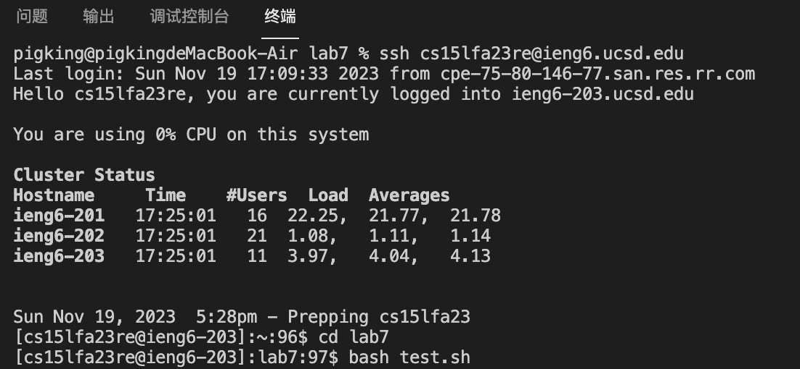
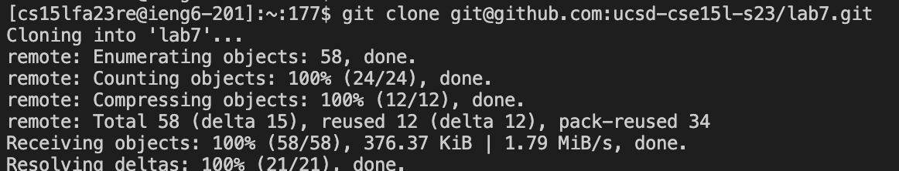
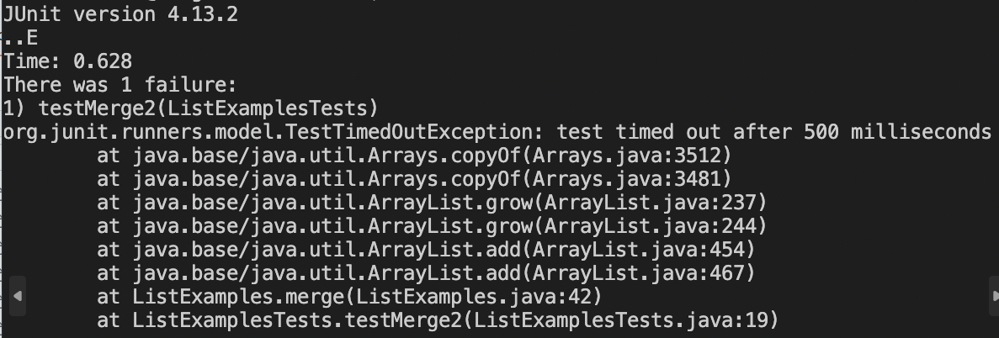
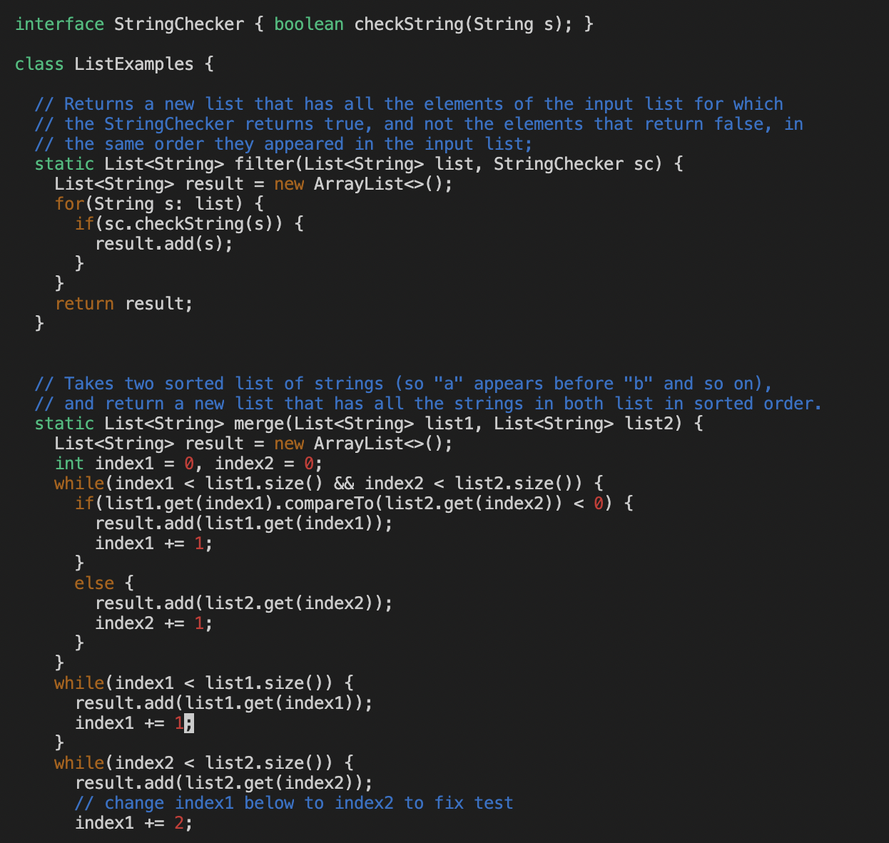
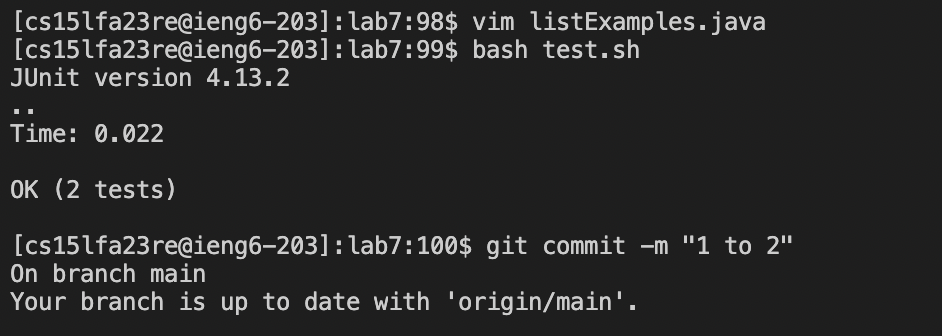
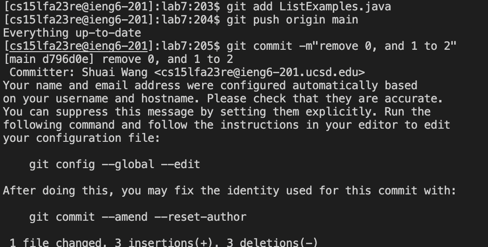

1.```<up><enter>```Use this command to find my account and log in.<br> 
2.```<up><up><up><up><up><enter>```Use this command to clone the file from my git hub.<br> 
3.```<up><up><up><up><up><up><enter>```, ```cd lab7```command was 6 up in the search history, change the directory to lab7.<br> 
4.```<up><up><up><enter>```,```bash test.sh``` command was 3 up in the history use this to run the test.<br> 
5```<up><up><up><up><enter>``` ```vim ListExamples.java``` was 4 up in the history,so i use this to get in to vim.<br> 
6```<:(0,s};>``` find the place should be correct.```<x><x>```delete the 0 and <,>.<br> 
7```<:/index += 1;>``` find the place should be correct.```<right><right><right><right><right><x><I><2>```change the index1 to index2.<br> 
8```<esc><:wq>```to save the change and quit.<br> 
9```<up><up><enter>```,```bash test.sh``` command was 2 up in the history,run the test again.<br> 
10```<up><up><up><up><up><up><enter>```,```git add ListExamples.java``` was 6 up in the history,add this.<br> 
11```<up><up><up><up><up><up><up><enter>```,```git push original main``` was 7 up in the history,push it.<br> 
12```<up><up><up><up><up><up><up><up><enter>```,```git commit -m``` was 8 up in the history.
